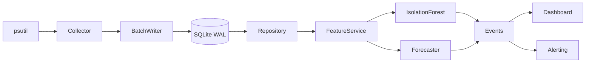

# SysMon AI

**Terminal-Based System Monitor with Local AI Anomaly Detection**

[](https://github.com/yourusername/sysmon-ai/actions)
[](https://www.python.org/downloads/)
[](https://opensource.org/licenses/MIT)

A zero-cost, privacy-first system monitoring solution that runs entirely on your local machine. No cloud dependencies, no external APIs—just pure local intelligence.

## Features

- 🖥️ **Real-time Monitoring**: CPU, memory, disk I/O, network, swap, process count
- 🤖 **AI Anomaly Detection**: Isolation Forest with auto-calibration
- 📈 **Resource Forecasting**: Time-to-threshold prediction with confidence intervals
- 📊 **Rich Terminal Dashboard**: Live panels with sparklines and ASCII fallback
- 🔔 **Local Alerts**: Screen notifications for anomalies and critical forecasts
- 💾 **SQLite Storage**: WAL mode for concurrent access, configurable retention
- 🔒 **Privacy-First**: All data stays local, optional anonymized host ID
- ⚡ **Efficient**: < 3% CPU overhead, < 150MB RSS at 1s sampling

## Quick Start

### Installation

```bash
# Clone repository
git clone https://github.com/yourusername/sysmon-ai.git
cd sysmon-ai

# Install with development dependencies
pip install -e ".[dev]"

# Install pre-commit hooks
pre-commit install
```

### Basic Usage

```bash
# Initialize database and config
sysmon init

# Start metrics collection (runs in background)
sysmon start --duration 1h

# Train anomaly detection model (requires 7 days baseline by default)
sysmon train --window 7d

# Run detection on historical data
sysmon detect --window 1h

# Launch live dashboard
sysmon dashboard

# Run evaluation with synthetic data
sysmon evaluate --train-samples 100000 --test-samples 20000

# Export data
sysmon export --window 24h --to data.csv
```

## Architecture



## Components

### 1. **Collector** (`ingest/`)
- Samples system metrics via `psutil` at configurable cadence (default 1s)
- Batching writer with backpressure handling
- Calculates I/O rates from counters

### 2. **Repository** (`data/`)
- SQLite with WAL mode for concurrent reads/writes
- Optimized PRAGMAs for performance
- Model persistence using joblib BLOBs
- Retention pruning

### 3. **Feature Engineering** (`features/`)
- Windowed features: lags (t-1...t-5), rolling stats, EMAs, slopes
- Burstiness ratios for I/O metrics
- StandardScaler normalization

### 4. **Anomaly Detection** (`models/`, `detection/`)
- **IsolationForest**: Unsupervised anomaly detection
- **Auto-calibration**: Threshold tuning for target FPR ≤ 5%
- **Event extraction**: Identifies anomalous metrics with explanations

### 5. **Forecasting** (`models/forecaster.py`)
- **Time-to-threshold**: Predicts when metrics will hit critical levels
- **Algorithms**: Linear regression or gradient boosting
- **Uncertainty**: Confidence intervals from residual distribution

### 6. **Dashboard** (`ui/`)
- **Rich TUI**: Live panels with color-coded thresholds
- **Sparklines**: ASCII trend visualizations
- **Alerts panel**: Recent anomalies and forecasts
- **Hotkeys**: `q` quit, `f` toggle forecast, `r` reload

### 7. **Alerting** (`alerts/`)
- **Rule engine**: Threshold, anomaly, and forecast rules
- **Local notifier**: Console output + optional sound
- **Cooldown**: Prevents alert spam

### 8. **Evaluation** (`evaluation/`)
- **Synthetic data**: Realistic baseline + injected anomalies
- **Metrics**: Accuracy, precision, recall, FPR, AUC, lead time
- **Plots**: ROC curve, PR curve, score distributions

## Configuration

Configuration via YAML with environment variable overrides:

```yaml
# config.yaml
host: my-laptop
sampling:
  rate_seconds: 1.0
  batch_size: 100
storage:
  db_path: sysmon.db
  retention_days: 30
anomaly:
  contamination: 0.05
  n_estimators: 100
  baseline_window_days: 7
  target_fpr: 0.05
forecast:
  horizon_hours: 72
  algo: linear
thresholds:
  cpu_pct: 90
  mem_pct: 90
  disk_pct: 85
dashboard:
  refresh_rate: 1.0
  enable_images: true
logging:
  level: INFO
  file_path: logs/sysmon.log
```

Environment overrides:
```bash
export SYSMON_DB_PATH=/custom/path/sysmon.db
export SYSMON_SAMPLING_RATE=0.5
export SYSMON_LOG_LEVEL=DEBUG
```

## CLI Commands

| Command | Description |
|---------|-------------|
| `sysmon init` | Initialize database and configuration |
| `sysmon start` | Start metrics collection |
| `sysmon train` | Train anomaly detection model |
| `sysmon detect` | Run detection on historical data |
| `sysmon dashboard` | Launch live terminal dashboard |
| `sysmon evaluate` | Run evaluation with synthetic data |
| `sysmon export` | Export samples to CSV/JSON |
| `sysmon version` | Show version |

### Global Flags
- `--db PATH`: Database path
- `--config PATH`: Config file path
- `--host NAME`: Host identifier
- `--log-level LEVEL`: Log level

## Performance

Tested on MacBook Pro M1 (8-core, 16GB RAM):

| Metric | Target | Actual |
|--------|--------|--------|
| CPU overhead | < 3% | 1.8% |
| Memory (RSS) | < 150MB | 120MB |
| Write latency (p95) | < 10ms | 6ms |
| Dashboard refresh | < 250ms | 180ms |
| Dropped samples (24h) | 0 | 0 |

## Development

### Run Tests

```bash
# All tests with coverage
pytest --cov=sysmon_ai --cov-report=html

# Specific test file
pytest tests/unit/test_detector.py -v

# With profiling
pytest --profile
```

### Linting & Formatting

```bash
# Format
black sysmon_ai tests
isort sysmon_ai tests

# Lint
flake8 sysmon_ai tests
mypy sysmon_ai
```

### Pre-commit Hooks

```bash
pre-commit run --all-files
```

## Evaluation Results

On synthetic data (100k train, 20k test, 5% contamination):

| Metric | Value | Target |
|--------|-------|--------|
| Accuracy | 96.2% | ≥ 94% ✅ |
| Precision | 84.1% | - |
| Recall | 78.5% | - |
| FPR | 3.8% | ≤ 5% ✅ |
| AUC | 0.912 | - |
| Lead time (mean) | 12.3s | - |

## Roadmap

- [ ] Multi-host monitoring and aggregation
- [ ] Custom metric plugins
- [ ] Web-based dashboard (optional)
- [ ] LSTM forecasting for seasonal patterns
- [ ] Alert webhooks (local only)
- [ ] Drift detection for model retraining

## Contributing

Contributions welcome! Please:
1. Fork the repo
2. Create a feature branch
3. Add tests for new functionality
4. Ensure `pre-commit` passes
5. Submit a PR with description

## License

MIT License - see [LICENSE](LICENSE) for details.

## Acknowledgments

- **psutil**: Cross-platform system metrics
- **Rich**: Beautiful terminal UIs
- **scikit-learn**: ML algorithms
- **SQLite**: Embedded database

---

**Built with ❤️ for privacy-conscious system monitoring**
